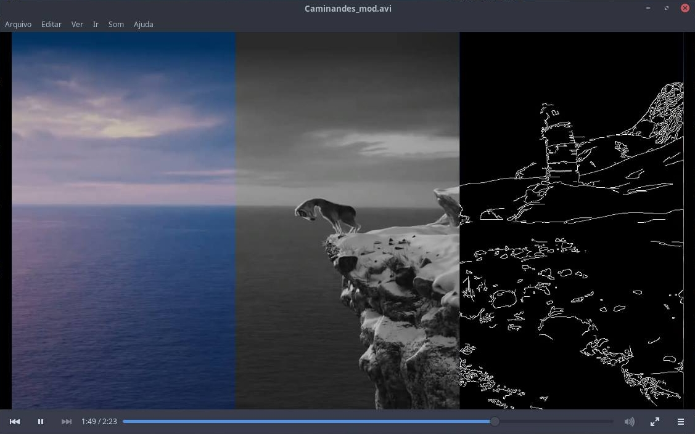

## 3 Layers

Um projeto divertido, para um primeiro contato com o OpenCV.

O programa aplica uma  edição em uma entrada de vídeo (.avi), dividindo-a em três partes:

- Frames originais e coloridos, no lado esquerdo.
- No centro, uma mascara em escala de cinza.
- No canto direito, um detector de bordas ( 'Canny Edge Detector' )

### Requisitos:

- OpenCV (3.x ++)
- Python (3.x ++)
